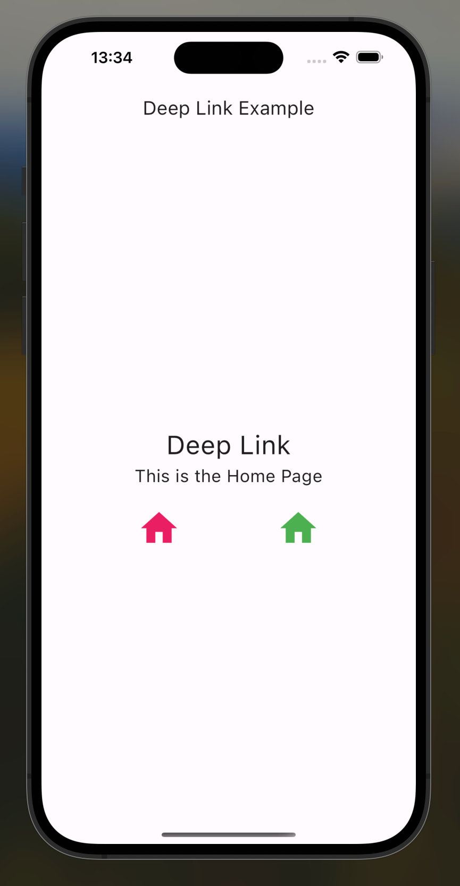
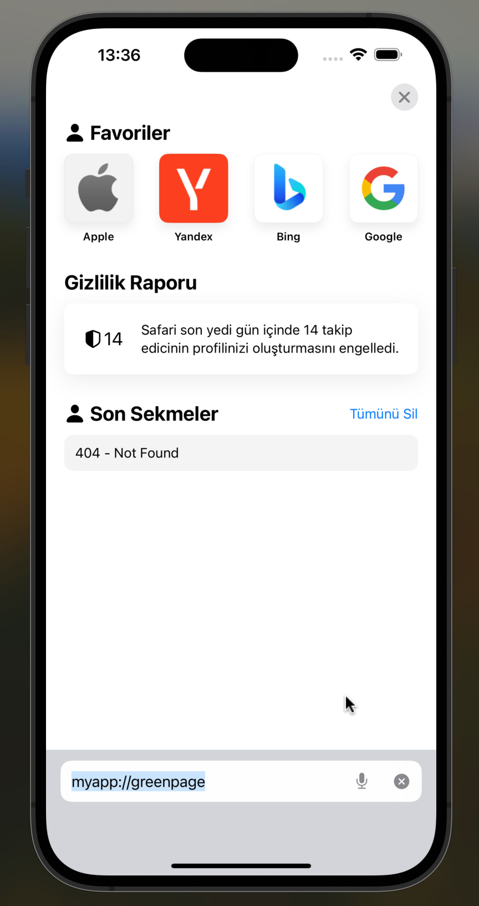
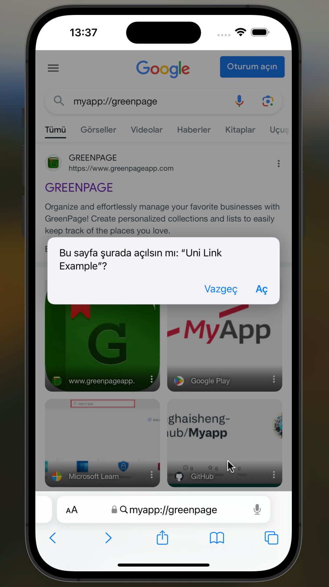
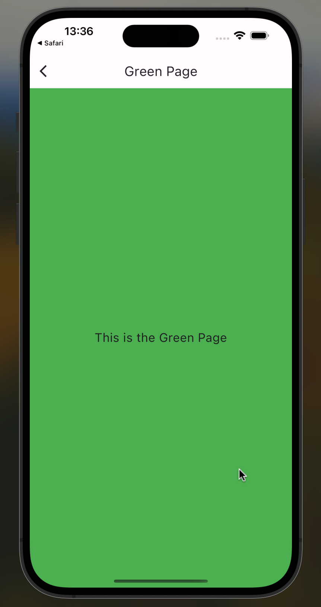

# uni_link_example

Bu Flutter uygulaması, "uni_links" paketini kullanarak derin bağlantıları (deep links) dinleyerek belirli sayfalara doğrudan erişim sağlar. Anasayfada iki farklı sayfaya yönlendirme yapabilen basit bir örnektir.
## Başlangıç

1. **Kurulum**
   
   Projeyi klonlayın ve gerekli paketleri yükleyin:
   ```bash
   git clone https://github.com/melikeyogurtcu/Flutter-Uni-Linking.git   
2. **Gerekli paketleri yükleyin:**

    ```bash
   flutter pub get

## Derin Bağlantıları Test Etme

Bu uygulama, belirli URL'leri dinleyerek derin bağlantıları işler. Uygulamanın başlangıç noktası olan MyHomePage widget'ı, derin bağlantıları dinlemek için uni_links paketini kullanır. Ana sayfada belirli URL'ler tespit edildiğinde, ilgili sayfalara yönlendirme yapar.

1. **iOS için**

Derin bağlantıları test etmek için, simülatörünüzdeki tarayıcıda aşağıdaki URL'leri yazıp enter'a basın:

- Pembe Sayfa: myapp://pinkpage
- Yeşil Sayfa: myapp://greenpage


Ya da terminalde aşağıdaki kodları kullanın.

- Ana Sayfa: xcrun simctl openurl booted "myapp://"  
- Yeşil Sayfa: xcrun simctl openurl booted "greenpage://"  
- Pembe Sayfa: xcrun simctl openurl booted "pinkpage://"  

2. **Android için**

Emülatörünüzdeki tarayıcıda aşağıdaki URL'leri yazıp enter'a basın:

- Pembe Sayfa: pinkpage://
- Yeşil Sayfa: greenpage://


Ya da terminalde aşağıdaki kodları kullanın.

- Yeşil Sayfa: adb shell am start -W -a android.intent.action.VIEW -d "greenpage://" com.example.uni_link_example

- Pembe Sayfa: adb shell am start -W -a android.intent.action.VIEW -d "pinkpage://" com.example.uni_link_example

## Görseller

|  |  |
|----------------------------------|---------------------------------|
|      |  |


## Notlar

- Derin bağlantıları iOS ve Android için ayrı ayrı yapılandırmanız gerekebilir. Bunun için ilgili platformlara göre Info.plist ve AndroidManifest.xml dosyalarınızı güncellemelisiniz.
- Derin bağlantıları dinleyen kodlarınızı uygulamanızın gereksinimlerine uygun şekilde özelleştirebilirsiniz.
